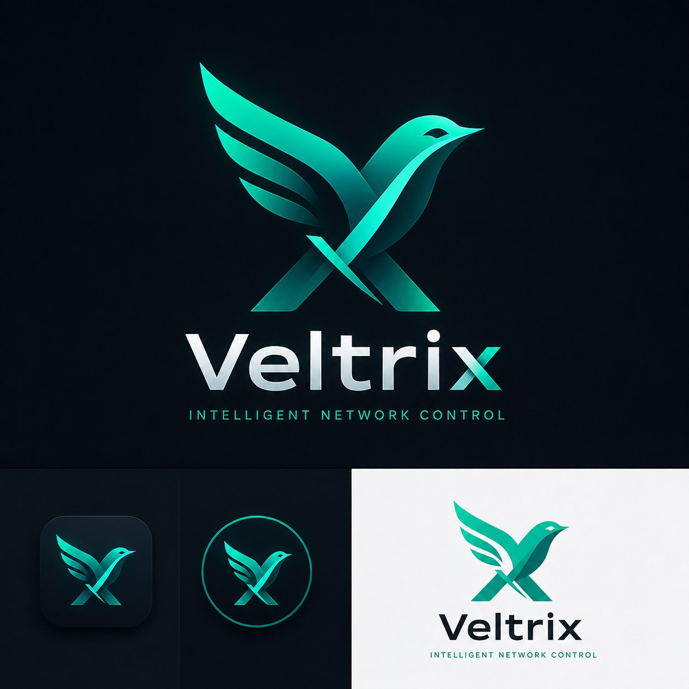

<p align="center">
  
</p>

<h1 align="center">Veltrix</h1>

<p align="center">
  <strong>Intelligent Network Control</strong>
</p>

<p align="center">
  داشبورد حرفه‌ای مدیریت سرورهای x-ui، پایش اوتباندهای V2Ray، اعلان رخدادها و کنترل لایسنس تجاری.
</p>

---

## معرفی

**Veltrix** یک وب اپلیکیشن self-hosted برای فروشندگان اوتباند، اپراتورهای شبکه و تیم‌هایی است که چندین سرور x-ui/V2Ray را مدیریت می‌کنند. Veltrix وضعیت منابع سرورها، سلامت مسیرها، پینگ اوتباندها، رخدادها، اعلان‌ها، بکاپ‌ها و دسترسی مدیرها را از یک داشبورد واحد کنترل می‌کند.

این پروژه برای استفاده تجاری و فروش لایسنس طراحی شده است. License Server خصوصی و زیرساخت صدور لایسنس داخل این repository قرار نمی‌گیرد.

## قابلیت‌های اصلی

- مدیریت چندین سرور x-ui
- همگام‌سازی inbound های x-ui و نمایش آن‌ها به عنوان اوتباند / مسیر V2Ray
- پایش CPU، RAM، Disk، Uptime و وضعیت Xray در صورت پشتیبانی پنل
- تست TCP ping برای هر اوتباند
- تشخیص وضعیت‌های `ok`، `high`، `timeout`، `error` و `disabled`
- صفحه جزئیات سرور با Health Score، نمودار منابع، نمودار پینگ و خطاهای اخیر
- مدیریت رخدادها با وضعیت‌های `open`، `acknowledged` و `recovered`
- اعلان مرورگر، Telegram و Webhook
- ادمین اصلی با دسترسی کامل
- امکان ساخت حداکثر ۱۰ مدیر با سطح دسترسی قابل تنظیم
- تغییر رمز حساب و محدودسازی تلاش ورود ناموفق
- بکاپ، دانلود، حذف و ریستور دیتابیس
- آماده برای نصب روی Linux با systemd
- Dockerfile برای اجرای containerized
- کلاینت لایسنس تجاری با اتصال به License Server خصوصی

## مدل لایسنس تجاری

Veltrix نرم‌افزار تجاری و proprietary است. استفاده، نصب، تغییر، توزیع، فروش مجدد یا ارائه سرویس به اشخاص ثالث بدون دریافت لایسنس معتبر از iPmartNetwork مجاز نیست.

هر لایسنس فقط برای یک IP عمومی سروری صادر می‌شود که Veltrix روی آن نصب شده است.

| پلن | محدودیت | مناسب برای |
| --- | --- | --- |
| Pro | تا ۲۰ سرور | فروشندگان کوچک و متوسط اوتباند |
| Enterprise | تا ۶۰ سرور و ۶۰ اوتباند | تیم‌ها و فروشندگان پرترافیک |

مدت لایسنس:

- ۶ ماهه
- یک ساله
- مادام‌العمر

## ساختار پروژه

```text
Veltrix/
  outpanel/          Backend, API, auth, licensing client, monitoring, backup
  web/               Persian RTL dashboard and static assets
  docs/              Product, architecture, roadmap and licensing notes
  scripts/           Development and Linux installer scripts
  systemd/           Production systemd service
  apps/              Future app boundaries for API, web and worker
  packages/          Future shared package boundary
  Dockerfile         Container runtime definition
  .env.example       Production environment template
  README.md          Project documentation
  CHANGELOG.md       Release notes
```

## پیش‌نیازها

- Python 3.12 یا جدیدتر
- Linux برای نصب production با systemd
- Docker برای اجرای containerized، اختیاری
- دسترسی به پنل x-ui برای هر سرور

Veltrix در نسخه فعلی عمدتا از کتابخانه استاندارد Python استفاده می‌کند.

## اجرای محلی

از ریشه پروژه:

```bash
python -m outpanel.app --host 127.0.0.1 --port 8000
```

داشبورد:

```text
http://127.0.0.1:8000
```

در اولین اجرا، صفحه ساخت ادمین اصلی نمایش داده می‌شود.

## اجرای Docker

```bash
docker build -t veltrix:latest .

docker run --rm -p 8000:8000 \
  -v veltrix-data:/app/data \
  -v veltrix-backups:/app/backups \
  --env OUTPANEL_REQUIRE_LICENSE=0 \
  veltrix:latest
```

## نصب روی Linux

```bash
git clone https://github.com/iPmartNetwork/Veltrix.git
cd Veltrix
sudo bash scripts/install-linux.sh
```

نصب‌کننده:

- پروژه را داخل `/opt/veltrix` کپی می‌کند.
- کاربر سیستمی `veltrix` می‌سازد.
- فایل env را در `/etc/veltrix.env` ایجاد می‌کند.
- سرویس `veltrix.service` را فعال و اجرا می‌کند.

بررسی وضعیت سرویس:

```bash
systemctl status veltrix.service
```

## متغیرهای محیطی مهم

| Variable | توضیح |
| --- | --- |
| `OUTPANEL_HOST` | آدرس bind وب سرور |
| `OUTPANEL_PORT` | پورت وب سرور |
| `OUTPANEL_DB` | مسیر دیتابیس SQLite |
| `OUTPANEL_BACKUP_DIR` | مسیر ذخیره بکاپ‌ها |
| `OUTPANEL_MONITOR_INTERVAL` | فاصله اجرای مانیتورینگ بر حسب ثانیه |
| `OUTPANEL_API_TOKEN` | توکن API برای اتوماسیون امن |
| `OUTPANEL_REQUIRE_LICENSE` | فعال‌سازی الزام لایسنس |
| `OUTPANEL_LICENSE_SERVER_URL` | آدرس License Server خصوصی |
| `OUTPANEL_SERVER_PUBLIC_IP` | IP عمومی سرور برای binding لایسنس |

## اتصال به x-ui

برای هر سرور این موارد وارد می‌شود:

- نام سرور
- IP یا دامنه عمومی
- آدرس پنل x-ui
- نام کاربری و رمز عبور پنل
- آستانه هشدار CPU، RAM و ping
- timeout اتصال

Veltrix برای تست پینگ از TCP connect استفاده می‌کند، چون ICMP ping روی بسیاری از سرورها نیازمند permission سطح سیستم است.

## امنیت

- رمز کاربران با PBKDF2-SHA256 ذخیره می‌شود.
- session ها با cookie از نوع HttpOnly نگهداری می‌شوند.
- بعد از تغییر رمز، session های دیگر همان کاربر حذف می‌شوند.
- تلاش ورود ناموفق rate limit دارد.
- رمز x-ui در خروجی API سرورها به داشبورد برگردانده نمی‌شود.
- ادمین اصلی همیشه دسترسی کامل دارد.
- مدیرها فقط به بخش‌هایی دسترسی دارند که ادمین اصلی تعیین کرده است.

## مواردی که نباید در GitHub قرار بگیرند

- `data/*.db`
- `data/*.db-*`
- `data/license-cache.json`
- `data/instance.id`
- `logs/`
- `backups/`
- `.env`
- License Server خصوصی

## تست‌های پایه توسعه

```bash
python -m compileall -q outpanel
node --check web/assets/app.js
```

## وضعیت توسعه

Veltrix نسخه `0.1.0` شامل هسته اصلی محصول است. موارد پیشنهادی برای مراحل بعد:

- Docker Compose کامل
- installer حرفه‌ای‌تر با مسیر upgrade
- migration system برای دیتابیس
- رمزنگاری credentials حساس در دیتابیس
- گزارش‌گیری مدیریتی
- اتصال نهایی به License Server خصوصی

## مجوز

Veltrix نرم‌افزار proprietary و تجاری است.

استفاده، نصب، تغییر، توزیع، sublicense، فروش مجدد، hosting عمومی یا ارائه این نرم‌افزار به اشخاص ثالث بدون لایسنس معتبر صادرشده توسط iPmartNetwork مجاز نیست.

برای جزئیات بیشتر، فایل `LICENSE.md` یا توافق‌نامه تجاری/EULA پروژه را مطالعه کنید.

## پشتیبانی

برای خرید لایسنس، پشتیبانی یا هماهنگی نصب، با تیم iPmartNetwork تماس بگیرید.

---
