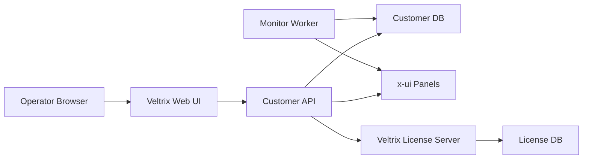

# Veltrix Architecture

Veltrix is moving from an MVP into a commercial self-hosted product with a central SaaS license service.

## Current Runtime Layout

```text
Veltrix Repository
  outpanel/                  Customer-installed app backend and monitor
  web/                       Current built-in dashboard
  apps/api/                  Future dedicated customer API package
  apps/worker/               Future dedicated monitoring worker package
  apps/web/                  Future React/Vite dashboard
  packages/shared/           Future shared contracts and validation
  deploy/                    Nginx/systemd/docker assets
```

## Target Runtime



## Next Refactor Boundary

The current `outpanel/` package remains the working customer app while we add commercial features. When Node/npm is available, `apps/web/` should become a React + Vite + TypeScript frontend and consume the existing API.

The Veltrix License Server belongs in a separate private project. The public customer app repository should only contain the license client integration and the public API contract needed to activate or validate a license.
