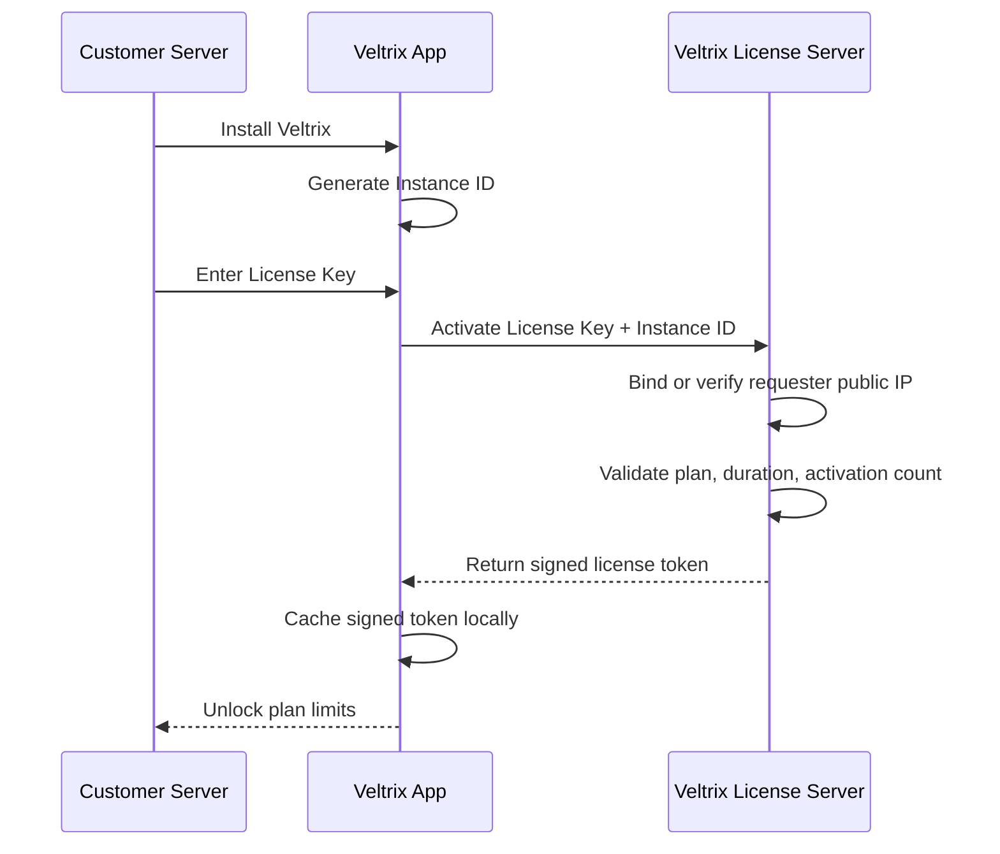

# Veltrix Licensing Design

Veltrix is planned as a commercial self-hosted product. Customers install the software on their own Linux server, then activate it with a license purchased through support. Each license is valid for exactly one public server IP.

## Activation Flow



## Why Signed Tokens

The customer installation should not trust a plain database value such as `plan=enterprise`. The license server should sign a license payload with a private key. The customer app only ships with the public key, so it can verify the token but cannot create fake licenses.

Recommended signing:

- Ed25519 or RSA-PSS
- Payload includes license id, plan, duration, instance id, bound public IP, issued at, expires at, and feature limits
- App caches the token locally to survive temporary license server downtime

## License Payload

```json
{
  "license_id": "lic_...",
  "customer_id": "cus_...",
  "plan": "enterprise",
  "duration": "1y",
  "instance_id": "generated-on-install",
  "bound_ip": "203.0.113.10",
  "max_servers": 60,
  "max_outbounds": 60,
  "issued_at": "2026-05-12T00:00:00Z",
  "expires_at": "2027-05-12T00:00:00Z",
  "status": "active"
}
```

## Enforcement Points

- Creating a new server
- Comparing the current server public IP with the signed `bound_ip`
- Syncing/importing x-ui outbounds beyond the licensed limit
- Running worker checks after expiration grace period
- Accessing commercial alert channels such as Telegram/Email/Webhook

## Current Implementation Status

The current project already has:

- Product metadata for Veltrix
- Plan catalog for Pro and Enterprise
- License duration catalog
- Generated Instance ID stored in `data/instance.id`
- `/api/license` and `/api/license/catalog`
- IP binding fields: `bound_ip`, `detected_ip`, `ip_match`, `ip_unverified`, and `invalid_ip` state
- Server limit enforcement when `OUTPANEL_LICENSE_PLAN` and `OUTPANEL_LICENSE_KEY` are set

## Public IP Detection

The production license server should bind the license using the public IP observed from the activation request. On the installed app, `OUTPANEL_SERVER_PUBLIC_IP` can be set explicitly when the server is behind NAT or the local route only exposes a private IP.

The next commercial step is building the separate Veltrix License Server and adding signed-token validation to this app.
